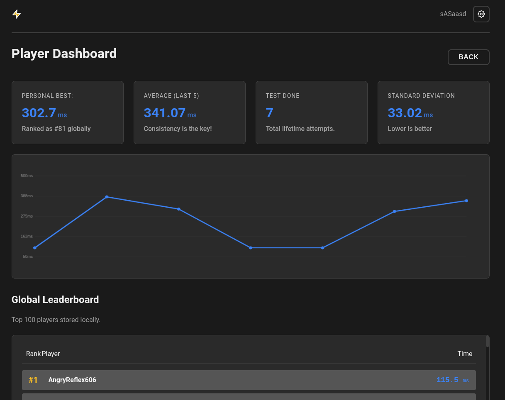

<h1>Reaction Tester</h1>

Reaction Tester is a web application made by using HTML, CSS and JS to make it compatible to run in the web. As the name stands, it is a web app where we can test our reflexes or rection speed. Here, I have used event listeners of js to input YOUR reaction time, web audio api to produce audio and local storage to store you usernames, stats and everything, Due to that Reaction tester features many more features that are listed below:

1. Leaderboard: Reaction Tester has a leaderboar where there are 100 scores locally stored and it makes it more fun as it brings challenges to reach at the top or beat a specific score.

2. Dashboard: Reaction Tester features a dashboard feature where your performance and scores are stored to make interactive charts, find standard deviation and average of your scores are calculated and visualized interactively. 

3. Customization: Reaction Tester also features customisaion where the user can customize their experience by changing their username, different types of themes and audio control.

<h2>Technologies Used:</h2>

<strong>HTML</strong>: Hyper Text Markup Language (HTML) is used to make the base structure of the web app.

<strong>CSS</strong>: Cascading Style Sheets (CSS) is used to style the elemnts of the web page to make it attractive and interactive to the user.

<strong>JS</strong>: Java Script (JS) is used to add the logic into the elements and make them functional to make the app work.

<h2>How to run it?</h2>

There are 2 ways to run or play this web app. They are as follows:

<h3>1. Play online!</h3>

i. Install any web browsers (if you haven't).

ii. Click the address bar and go to https://pratik-reaction-timetester.netlify.app/

iii. ENJOY!!

<h3>2. Play Offline!</h3>

i. Install VS Code and fork this repository into your github.

ii. Open VS Code and git clone the repository you cloned.

iii. Install Live Server extension and click 'Go Live' on the bottom right corner of the VS Code screen.

